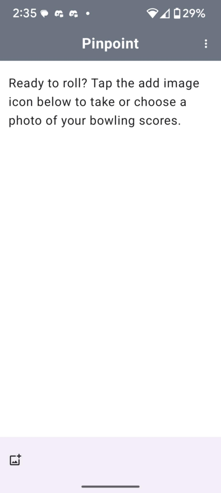
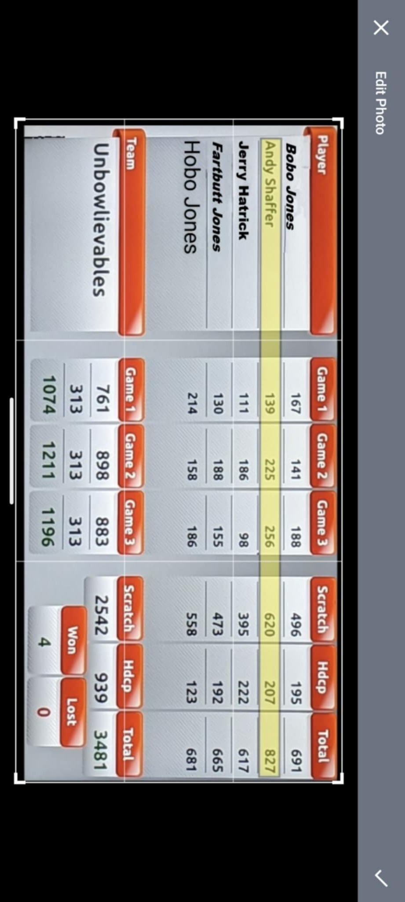
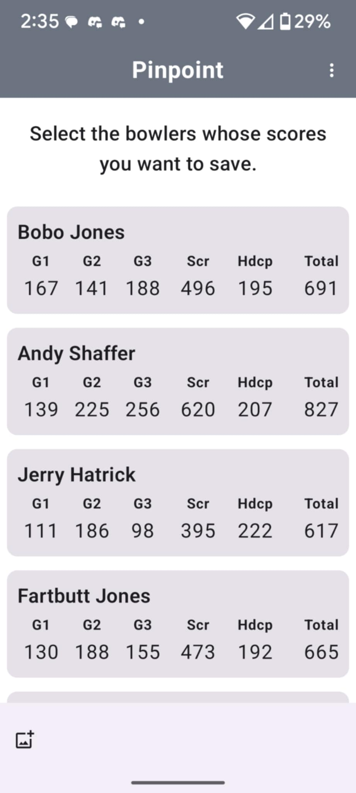

# PinPoint

PinPoint is an Android app for Bowlero/Lucky Strike league bowlers to record and track series scores by capturing score screens and processing them via OCR. It parses the results into structured player/game data and allows analysis of stats over time.

---

## Features

- **UI & Theming:** Jetpack Compose, Light/Dark theme with animated colors, PinpointTheme implementation started
- **Image Handling:** Camera/gallery capture, UCrop cropping, permission handling
- **OCR & Data:** ML Kit text recognition, parsing into `PlayerScore` objects, fuzzy header detection, row clustering
- **Project Setup:** StateFlow for loading/errors/images/text, Android Studio/Gradle 

For full change history, see [CHANGELOG.md](./CHANGELOG.md).

---

## Screenshots

  
  
  

